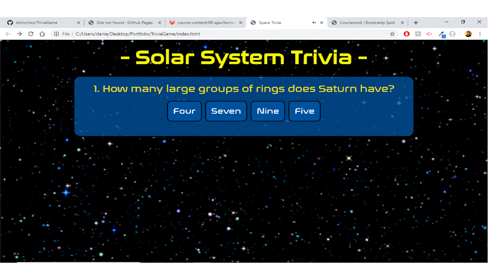

# TriviaGame
## Site Screenshots

## Technologies Used
- [Visual Studio Code](https://code.visualstudio.com/)
- [Git](https://git-scm.com/)
- [GitHub](https://github.com/)
- [Google Chrome](https://www.google.com/chrome/)
- [Meyer Web Reset Page](https://meyerweb.com/eric/tools/css/reset/)
- [Space Font](https://www.1001fonts.com/science-fiction+space-age-fonts.html)
- [Space Trivia Questions](https://conversationstartersworld.com/space-trivia-questions/)

## Summary
The purpose of this assignment was to create a Trivia Game that involved timed questions. If the user presses the correct button, it will add to their score count. If not, it will tell the user that they have guessed incorrectly and it will show them the correct answer.

## My Links
- [Github](https://github.com/dchicchon)
- [LinkedIn](https://www.linkedin.com/in/danielchicchon/)

